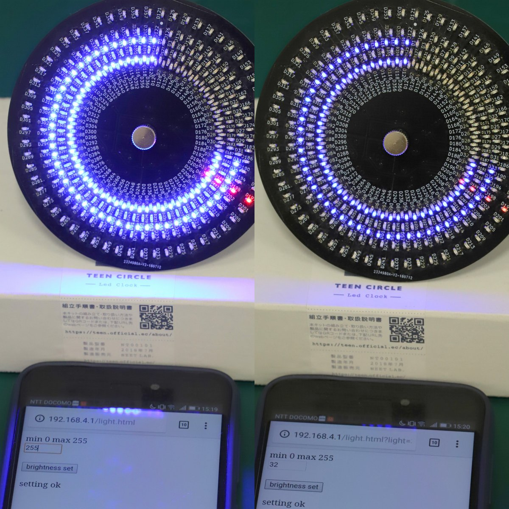

# teen circle  
  
  
teen circleのgithubのページです
回路図、ファームウェア、組み立て説明書、使い方説明書などをまとめています  
  
Rev２から調光機能を追加しました。[設定方法はこちら](doc/usage.md)  
スマートフォンの画面からLEDの明るさを変更することができます  
  
  
紹介動画  

  
## Documents  
[組み立て説明書](doc/buildguide.md)  
組み立て方の説明です、部品の半田付け、組み立てなどが記載してあります  
  
[使い方説明書](doc/usage.md)  
使い方の説明です、時刻の設定方法が記載してあります  
  
[時刻の読み方](doc/dial.md)  
時刻の読み方が記載してあります  
  
## ファームウェア  
[書き込み方法](doc/flash.md)  
使用してるマイコンESP32の書き込み方法を記載しています  