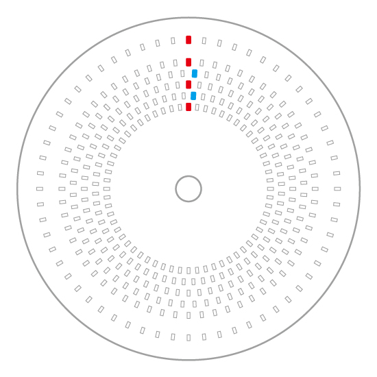
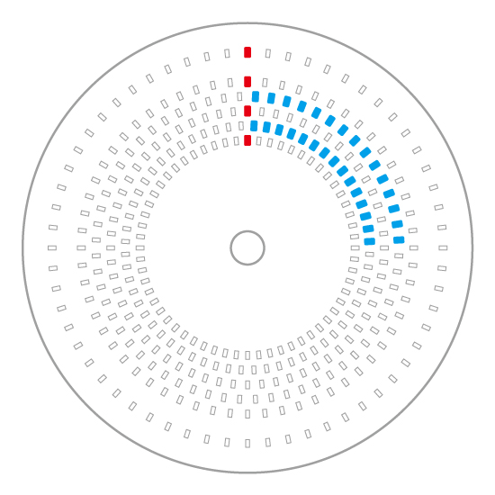
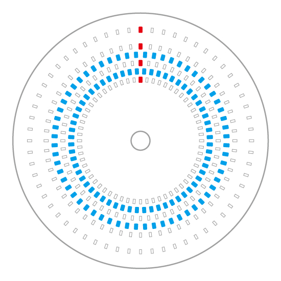
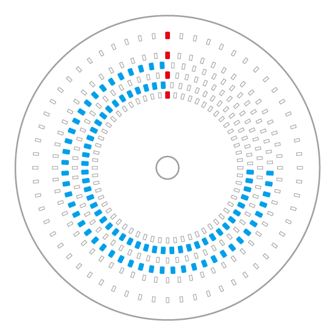
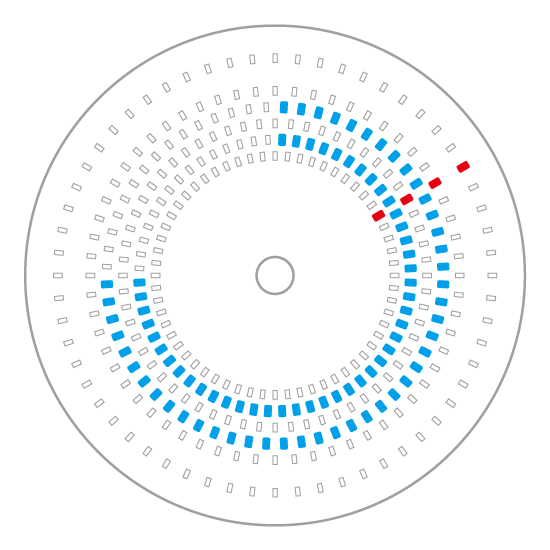
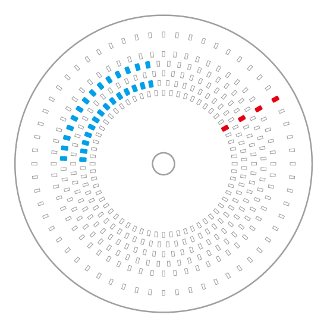

# 文字盤の読み方

TEEN CIRCLEは、組み立てた後も楽しく時計を使っていただくため、LEDでの文字盤だからこそできる表現の、特徴的な文字盤のデザインとなっています  
ほんの少しコツを掴めば、アナログ時計や７セグの時計よりも直感的に時の流れを感じてもらうことができます  

## 「時」の読み方  
青色のLEDは「時」を表します
午前は青色LEDの点灯数が増え続け、午後は順番に消灯してます  
時計の長針の動きと近いですが、２４時間それぞれで違う表示となり、日の昇り沈みを示すような表現となります  

午前１２時（０時）では青色のLEDが点灯していない状態です  
 

午前中は青色のLED表示は一時間ごとに増えます  
下図は「午前３時ちょうど」です  
 

午後１２時になると、青色のLEDは一周点灯する状態になります  
 

午後１時からは、青色のLED表示が順番に消えてます  
下図は「午後３時（15時）ちょうど」です  
 

## 「分」の読み方  
赤色のLEDは「分」を表します  
赤色のLEDはアナログ時計の短針と同じ動きをします  
下図は「午前９時１０分」です  
 

短針である赤色のLED表示は午前も午後も同じ動きをします  
下図の場合は「午後９時１０分（２１時１０分）」です  
 
