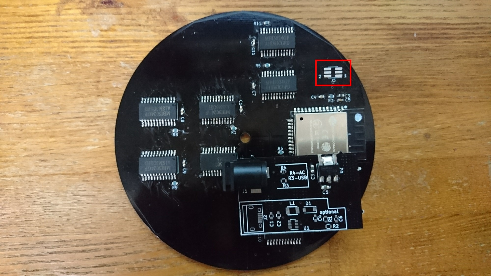
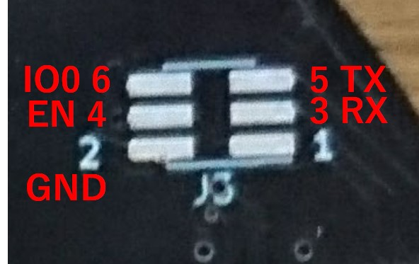
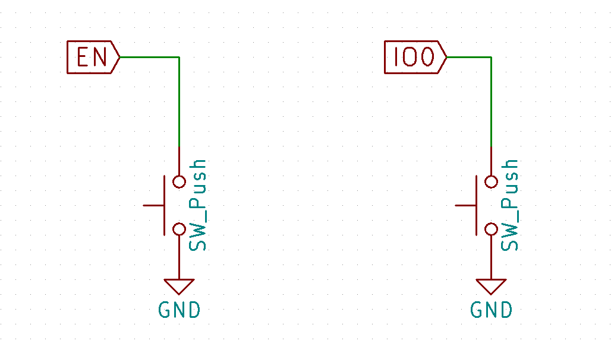
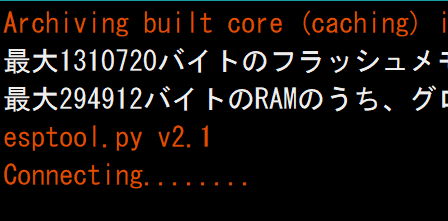
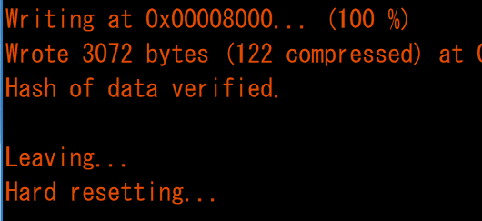

#スイッチ ファームウェアの書き込み方法  
ESP32へのファームウェア書き込み方法を説明します  

1. ハーフピッチで2列の[ピンヘッダ](http://www.aitendo.com/product/6880)、[ピンソケット](http://www.aitendo.com/product/11345)などをJ3に半田付けします  
  
  
2. 3.3VのUSB-UARTを用意します。[秋月電子](http://akizukidenshi.com/catalog/g/gM-05840/)や[aitendo](http://www.aitendo.com/product/2890)などで購入できます  
  
3. J3の3ピンがESP32側のRX,5ピンがTXなのでUSB-UARTのTXとRXを半田付けし、さらにGNDもつなぎます  
秋月電子さんのUSB-UARTの場合は以下の様な接続になります  
  
| USB-UART | 　 | J3 |
|-----------:|-----------:|-----------:|
| GND　黒 | - | GND 2ピン |
| CTS　茶 |  |  |
| ５V　赤 |  |  |
| TXD　橙 | - | RX ３ピン |
| RXD　黄 | - | TX ５ピン |
| RTS　緑 |  |  |
  
J3のピン配置は以下の様になります  
  
  
4. ESP32のファームウェアを書き込むモードにするためにはEN(J3:4ピン)とIO0(J3:6ピン)をGNDに落とす必要があります  
IO0(J3:6ピン)をGNDに落としたままにするとファームウェア書き込みモードに固定されるため、  
EN、IO0とGNDの間に[スイッチ](http://akizukidenshi.com/catalog/g/gP-03646/)を接続し、スイッチを押すとEN,IO0がGNDと接続されるようにします  
  
  
5. ファームウェアをビルドします。ビルドする方法は将来書くかもしれません  
  
6. ファームウェアを書き込みます  
(1)Arduino IDEの場合  
スケッチ→マイコンボードのの書き込みをクリックします  
Connecting.......の表示になると、ENとIO0両方のスイッチのボタンを押し、ENのスイッチだけボタンを離します  
  
Writing～の表示になるとIO00側のボタンも離します  
  
Hard resetting..の表示になったらファームウェアが書き込めてます  
  
リセットするためにENのスイッチのボタンを押して、離します  
これでリセットがかかり、書き込まれたファームでESP32が起動します  