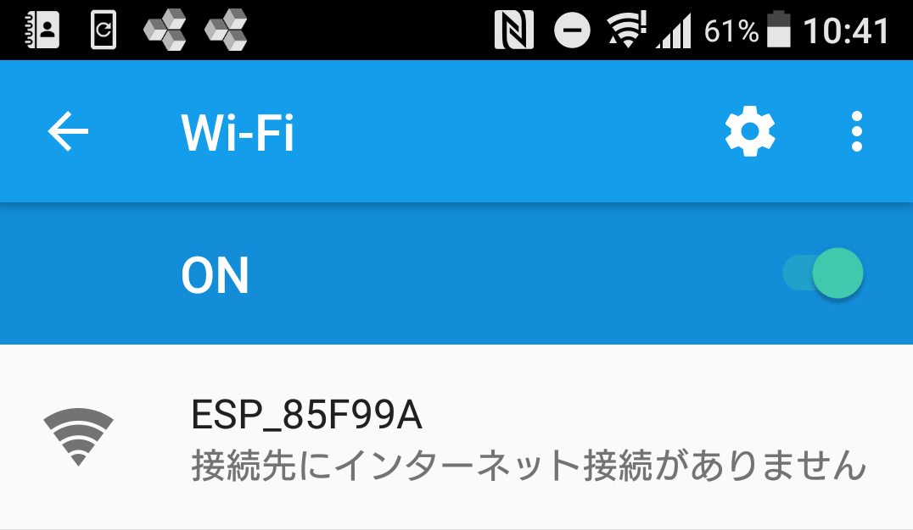
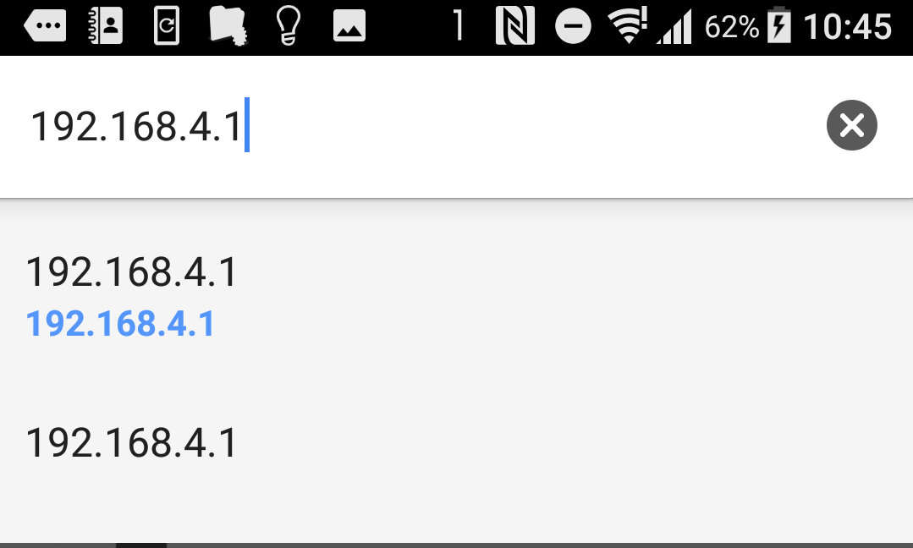
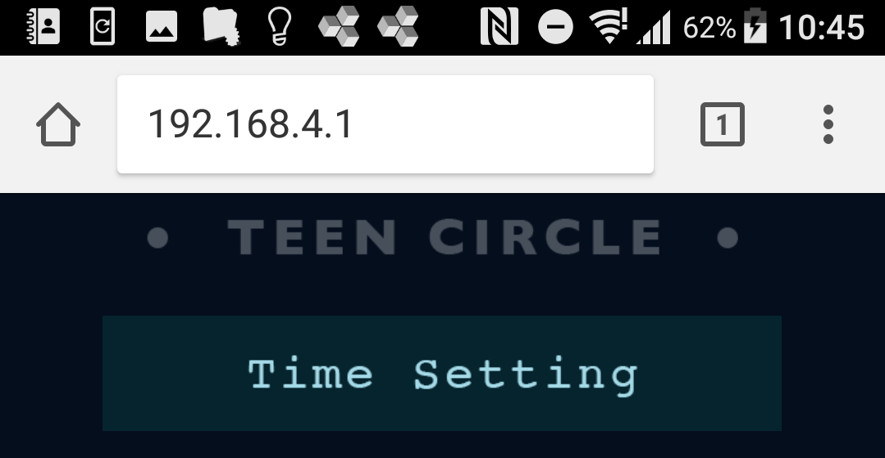
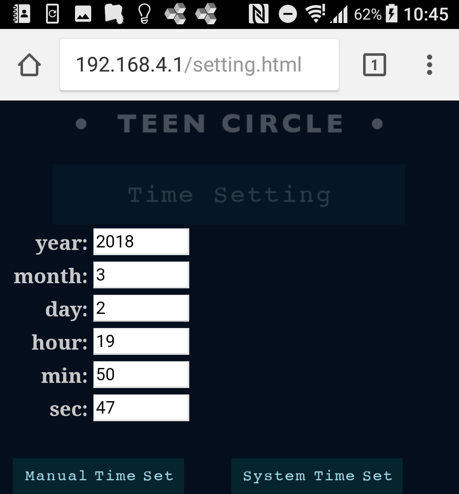
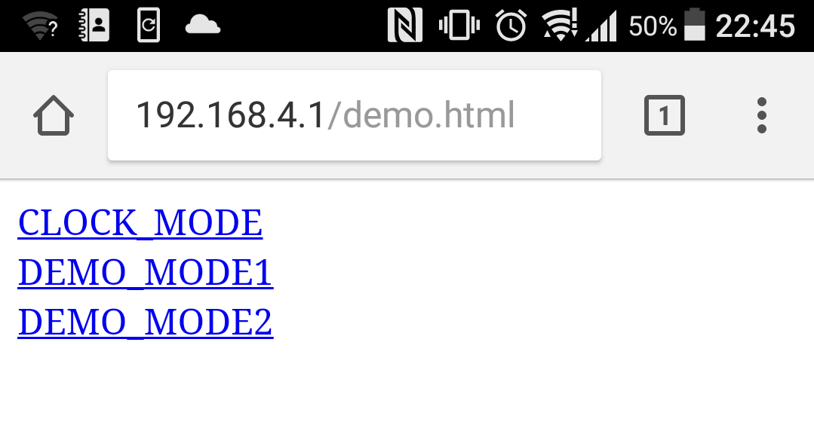

# 使い方
## 時刻設定  
  
1. DCジャックにACアダプタを接続します。青LEDと赤LEDが１列ごとに１周点灯したら正しく動作しています  
  
2. スマートフォンのWiFi設定から、ESP_XXXXXX(X:英数字)というアクセスポイントに接続します  
  
  
3. ChromeやSafariなどのブラウザを起動してURL欄に**192.168.4.1**と入力して実行します  
  
  
4. 以下の画面が表示されたらTime Settingをタップ    
  
  
5. 以下の画面で時刻を設定できます。System Time Setをタップでスマートフォンのシステム時刻をセットします  
また、テキストボックスに任意の日時を入力しManual Time Setをタップで任意の時間を設定できます  
  
  
※システム時刻は画面左側のテキストBOXには反映されません  
  
## デモモード  
  
動作デモ用にLEDを順に光らすパターンを繰り返します  
LEDの実装確認などに使用してください  
1. 192.168.4.1/demo.htmlとブラウザのURL欄に入力して実行します  
  
2.以下の画面が表示されたらDEMO1かDEMO2をタップしてモードを選択します  
  
  
  
MODE1 : 起動時のLED点灯パターンと同じ。青LEDと赤LEDが順に1列のみ1周点灯します  
MODE2 : 青LEDと赤LEDの全てのLEDが順に1周点灯します  