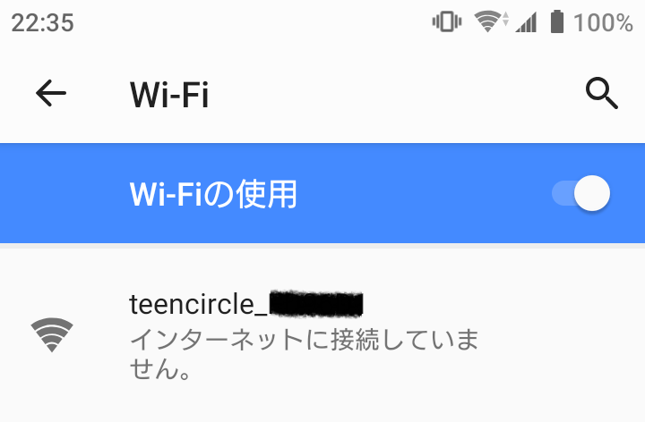
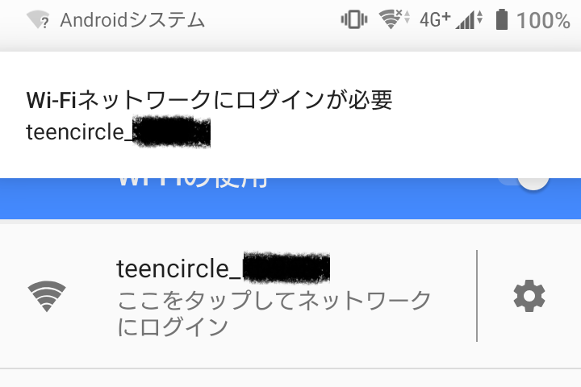

# 使い方(Wi-Fi Manager対応版)
  
1. Rev2までの基板ではDCジャックにACアダプタを接続します。Rev3の基板ではUSB PD(9V)対応のUSB充電器とUSBケーブルで接続します。  
青LEDと赤LEDが１列ごとに１周点灯したら正しく動作しています  
  
2. スマートフォンのWiFi設定から、teencircle_XXXXXX(X:英数字)というアクセスポイントに接続します  
  
  
3. 対応したスマートフォンではログインが必要と表示されるのでタップします。  
またはChromeやSafariなどのブラウザを起動してURL欄に**192.168.4.1**と入力して実行します(スマートフォンでモバイルネットワークに接続している場合は接続できないかもしれません)  
  
  
4. 設定画面が表示されるので設定したい項目をタップします  
  

    4.1. Configure WiFi  
    　teencircleが接続するWiFiアクセスポイントを設定します  
    　WiFiアクセスポイントに接続すると1時間ごとにNTPサーバーから時刻を取得します  

    4.2.　Setup  
    　LEDの明るさを調整できます。設定できる値は0-255です  

    4.3 Manual Time Setting  
    　手動で現在時間を設定できます  
    　"System Time Set"をタップすると接続してる端末が保有している時刻情報を反映します  
    　"Manual Time Set"をタップするとフォームに入力された値を現在時間として反映します  
    　WiFiアクセスポイントに接続済みの状態ではNTPサーバーから時刻を取得すると設定された時刻を上書きします  

    4.4 Mode Setting  
    　動作モードを変更できます  
    　CLOCK_MODE: 時刻表示を行います  
    　DEMO_MODE1: デモパターン1を表示します  
    　DEMO_MODE2: デモパターン2を表示します  
    　DEMO_MODE3: デモパターン3を表示します  

    4.5 Update  
    　ファームウェアアップデートをすることができます  
    　teencircle以外のファームウェアをアップロードすると動作しなくなりますので注意してください  

    4.6 Erase  
    　接続先として設定されているアクセスポイントの情報を削除します  

    4.6 Restart  
    　再起動を行います
